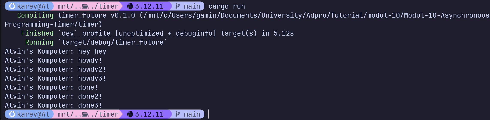
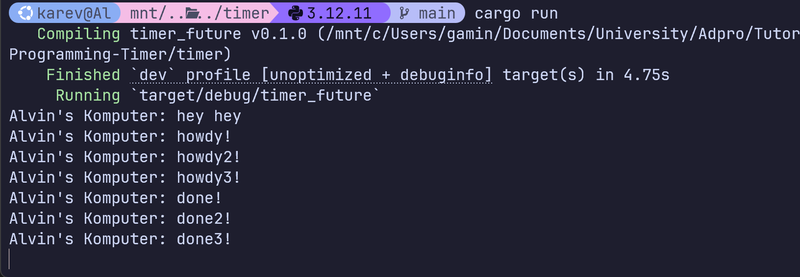

# Modul-10-Asynchronous-Programming-Timer

## Reflection

### Understanding how it works

Pesan yang baru ditambahkan ("Alvin's Komputer: hey hey") muncul pertama kali. Hal ini disebebkan karena baris println tersebut dieksekusi langsung di `main` secara sinkronus sebelum `executor.run()` dipanggil. Setelah pesan tersebut ditampilkan, `executor.run()` menjalankan spawner yang menjalankan fungsi `async` dan mencetak "howdy". Setelah itu kita menunggu selama 2 detik kemudian print done!

### Multiple Spawn and removing drop

Screenshot diatas menunjukkan output ketika ada kode drop. Kita dapat melihat bahwa message hey hey di print pertama kali sesuai dengan penjelasan sebelumnya. Setelah itu, ada 3 message howdy yang di print terlebih dahulu, kemudian diikuti dengan 3 message done. Hal ini menunjukkan bahwa task yang dibuat oleh spawner bersifat asinkronus sehingga dapat berjalan tanpa menunggu task yang lain untuk selesai terlebih dahulu.

Screenshot diatas menunjukkan output ketika tidak ada kode drop. Untuk outputnya kurang lebih sama dengan versi yang ada drop namun kita dapat melihat bahwa program hang dan berjalan terus tanpa berhenti. Ini disebabkan karena eksekutor masih menunggu untuk tugas-tugas baru karena tidak ada drop untuk memberitahunya bahwa tidak ada tugas lagi yang ditambahkan.