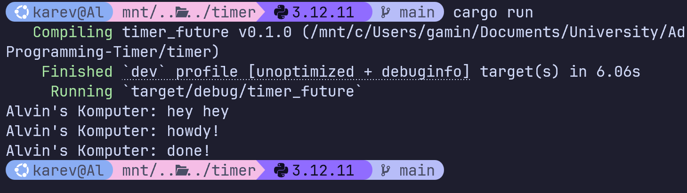

# Modul-10-Asynchronous-Programming-Timer

## Reflection

### Understanding how it works

Pesan yang baru ditambahkan ("Alvin's Komputer: hey hey") muncul pertama kali. Hal ini disebebkan karena baris println tersebut dieksekusi langsung di `main` secara sinkronus sebelum `executor.run()` dipanggil. Setelah pesan tersebut ditampilkan, `executor.run()` menjalankan spawner yang menjalankan fungsi `async` dan mencetak "howdy". Setelah itu kita menunggu selama 2 detik kemudian print done!